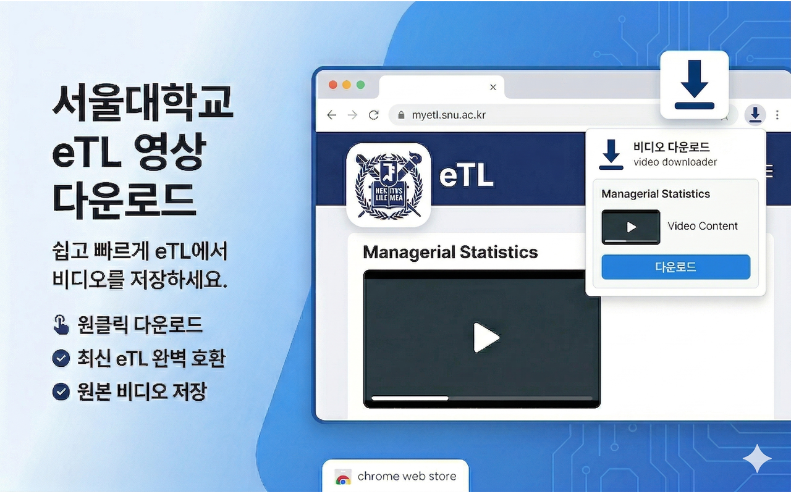

# 서울대 eTL 영상 다운로더

[SNU eTL](https://myetl.snu.ac.kr)에서 강의 영상을 다운로드합니다.

[English](README.md)

## 설치

[크롬 웹스토어](https://chromewebstore.google.com/detail/ajmkfkhbjinikeaihpakpaglfgdefehi)

## 사용법

1. SNU eTL 강의 영상 페이지로 이동
2. 확장 프로그램 아이콘 클릭
3. 다운로드 창에서 저장 확인
